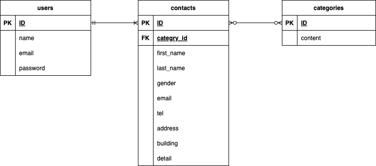

# お問い合わせフォーム

## 環境構築
### Dockerビルド
1. リポジトリをクローンします

　　`git clone git@github.com:mattyaaa/test-contact-form.git`

2. Dockerコンテナをビルドして起動します。

　　`docker-compose up -d --build`

* MySQLは、OSによって起動しない場合があるのでそれぞれのPCに合わせて docker-compose.ymlファイルを編集してください。

### Laravel環境構築
1. PHPコンテナに入ります。

　　`docker-compose exec php bash`

2. Composerをインストールします。

　　`composer install`

3. .env.example ファイルをコピーして .env ファイルを作成し、環境変数を編集します。

　　`cp .env.example .env`

4. アプリケーションキーを生成します。

　　`php artisan key:generate`

5. データベースのマイグレーションを実行します。

　　`php artisan migrate`

6. データベースのシーディングを実行します。

　　`php artisan db:seed`

## 使用技術
・ PHP：7.4.9

・ Laravel：8.75

・ MySQL：8.0.26

## ER図
以下にER図を示します。ER図はデータベースの設計図のようなものです。

## URL
・開発環境：http://localhost/

・phpMyAdmin：http://localhost:8080/